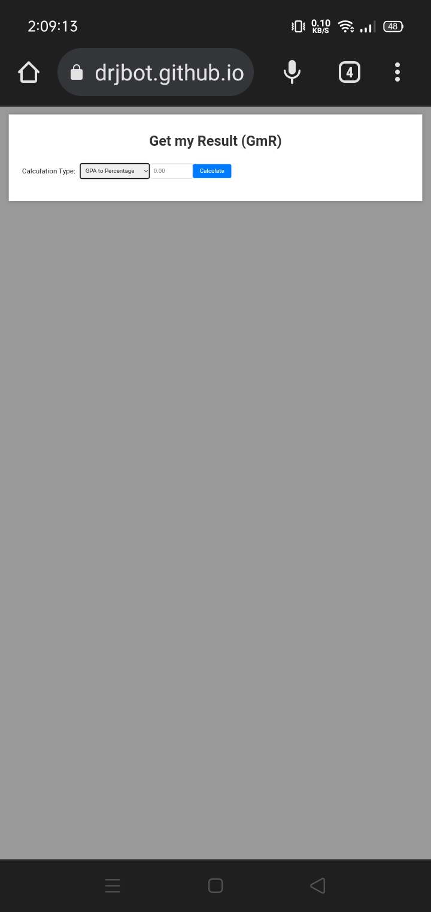
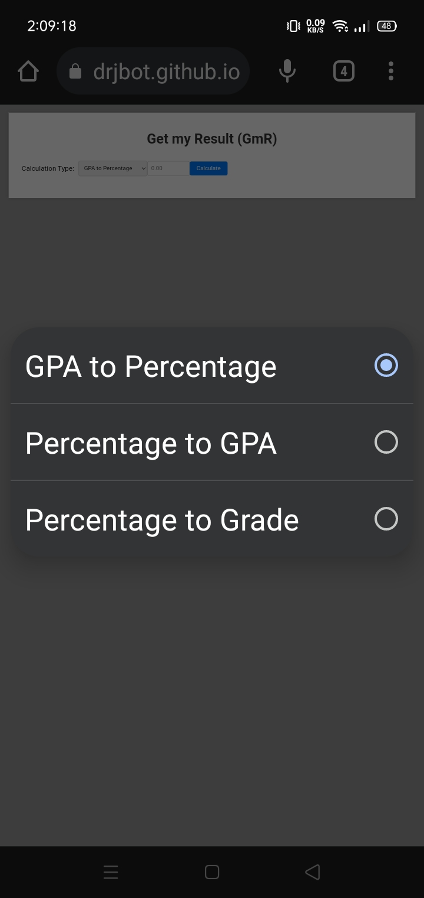
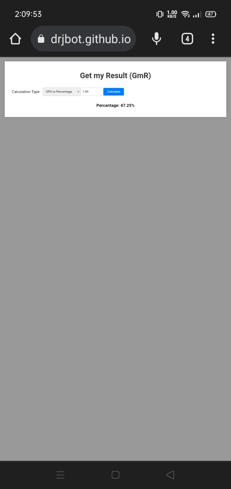

# Get my Result (GmR)

 

 

## Overview

Get my Result (GmR) is a simple web application that allows users to perform various result calculations, including GPA to Percentage, Percentage to GPA, and Percentage to Grade. The application provides an intuitive user interface for easy interaction and quick result generation.

## Features

- Calculation Type Selection: Users can choose from three different calculation types, including GPA to Percentage, Percentage to GPA, and Percentage to Grade.
- Input Validation: The application ensures that the input value falls within the valid range before performing the calculations.
- Result Display: The converted result is shown instantly below the input fields for quick reference.

## How to Use

1. Access the GmR web page by visiting [https://frr-drj.github.io/getmyresult/](https://thedrjbot.github.io/getmyresult/).
2. From the "Calculation Type" dropdown, select the type of calculation you want to perform:
   - **GPA to Percentage**: Convert GPA to Percentage.
   - **Percentage to GPA**: Convert Percentage to GPA.
   - **Percentage to Grade**: Convert Percentage to Grade.
3. Enter the appropriate value for the selected calculation type in the input field. Ensure the value is valid:
   - For GPA to Percentage: The GPA should be between 0.00 and 4.00.
   - For Percentage to GPA: The Percentage should be between 0 and 100.
   - For Percentage to Grade: The Percentage should be between 0 and 100.
4. Click the "Calculate" button to obtain the result.
5. The converted result will be displayed below the button, showing the Percentage, GPA, or Grade, depending on the selected calculation type.

## Technologies Used

- HTML
- CSS
- JavaScript

## Preview

## Visit the Website

To use Get my Result (GmR), visit the following link: [https://thedrjbot.github.io/getmyresult/](https://thedrjbot.github.io/getmyresult/)

## License

This project is licensed under the [MIT License](LICENSE). Feel free to use, modify, and distribute it as per the terms of the license.
